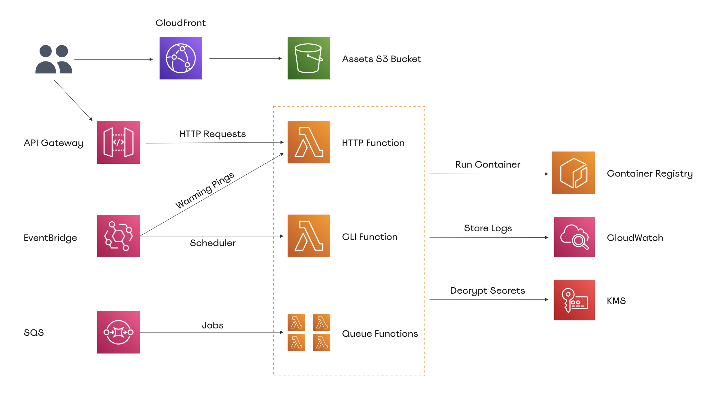

# Archticture Concept

Hover was built with enterprise applications in mind and is optimized for security and flexibility. Each stage of your application (dev, staging, production, sandbox, etc.) has its own manifest file in which you can configure the various AWS resources used by the stage. Each stage can be deployed using a different [AWS profile](https://docs.aws.amazon.com/cli/latest/userguide/cli-configure-profiles.html). Each profile can be associated with a different user, with granular permissions to manage only this stage, or even a different AWS account.

For each stage, Hover creates a number of Lambda functions, EventBridge rules, SQS queues and CloudWatch log groups. It also creates an ApiGateway API, CloudFront distribution, ECR Repository and S3 bucket.

On every deployment, the application code is packaged into a docker image along with the runtime. That image gets uploaded to an AWS ECR repository. Separately, your application asset files are uploaded to an S3 bucket.

Let's learn how Hover works with AWS to deploy and run the different parts of your application.



## AWS Lambda

Hover creates several AWS Lambda functions for each stage:

- One function to handle HTTP requests
- One function to execute CLI commands and run the Laravel scheduler
- Multiple functions to process jobs from different SQS queues

You can configure the memory, timeout, and concurrency of each function within the stage manifest file. You can also customise the various aspects of each queue function:

```yaml
http:
  memory: 512
  timeout: 30
  concurrency: 100
cli:
  memory: 512
  timeout: 900
  concurrency: 10
queue:
  default:
    memory: 512
    timeout: 120
    concurrency: 5
    tries: 3
    backoff: "5, 10"
    queues:
      - default
      - notifications
  priority:
    memory: 512
    timeout: 300
    concurrency: 10
    tries: 5
    backoff: "1"
    queues:
      - priority
```

In this example, Hover will create 4 functions. Two functions for handling HTTP requests and CLI invocations, and two functions for handling queued jobs.

ApiGateway will call the HTTP function whenever a request is made to your application. While the CLI Lambda will be called every minute by an EventBridge scheduling rule. It can also be invoked manually by using the 'hover command run' command.

The Lambda-SQS integration will be responsible for invoking the queue functions. This integration polls the specified queues in each Lambda for available jobs. When the integration detects a job, the function is called with the job payload.

## APIGateway & Handling HTTP Requests

Hover configures an APIGateway HTTP API and integrates it with the stage's HTTP function. The HTTP lambda is invoked by the gateway every time the API receives a request.

AWS generates a unique domain for each stage that can be used to test the application. It appears as follows:

```
https://d3876dg38.execute-api.eu-west-1.amazonaws.com
```

To access the app using your own domain, Hover utilizes APIGateway custom domain mappings.

## EventBridge Rules

Hover utilizes Amazon EvenBridge rules to invoke the CLI function every minute with the `php artisan schedule:run` command. If any of your application's scheduled jobs are due, the command will run them for you.

A warmer ping that calls the HTTP function every 5 minutes is another use case for EventBridge rules. This ping will be handled by the runtime that was added to your app when you ran 'hover build,' which will invoke a specified number of HTTP function containers concurrently. PHP-FPM will be running in each of these containers, waiting for HTTP requests to be processed.

## SQS Queues

Hover configures an integration to poll the queue for jobs and invoke the corresponding function with the job payload for each queue specified in the stage manifest file.

## CloudWatch Log Groups

A CloudWatch log group is created for each Lambda function created by Hover. The log group will contain all invocation records and logs. In your AWS console, you can inspect any of these log groups.

## Assets S3 Bucket & CloudFront Distribution

For each stage, Hover creates an S3 bucket and a CloudFront distribution. On every deployment, your application asset files are uploaded to the S3 bucket and served via the CloudFront CDN. This decreases latency when serving assets to users.

## Elastic Container Registery

Every stage has its own ECR repository. The repository will be used to publish the Hover-tagged docker image for each deployment. Hover then configures the various lambda functions that will be used to run the newly deployed tag.

## CloudFormation

Hover uses CloudFormation to manage the majority of the AWS resources required to deploy and run a stage. Every stage has its own stack, which is updated with each deployment.

## Key Management Service

For each stage, Hover uses KMS to store an encryption key. This key is generated by Hover and is never exposed. It is used internally to encrypt and decrypt the stage secrets when using the `hover secret encrypt` and `hover secret decrypt` commands. The runtime also uses it to decrypt secrets and populate environment variables each time a lambda container starts.
