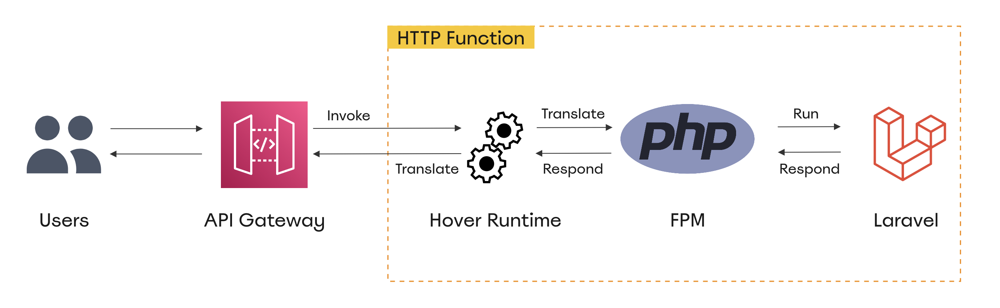
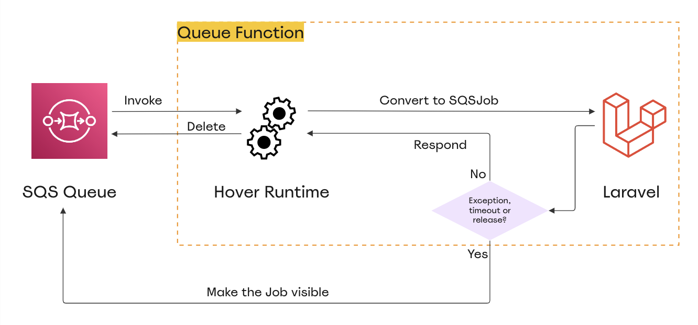

# The Runtime Environment

When you run `hover build <stage_name>`, Hover builds a Docker image from the specified `.Dockerfile`. For running a Laravel application, this image must have PHP and PHP-FPM installed along with several libraries and PHP extensions. A default `.Dockerfile` is created inside the `/.hover` directory when you create your first stage.

This Docker image will contain your application files, runtime environment files, encrypted secrets file and the manifest file. The entry point of the image is a [bootstrap file](../embeds/stubs/hover_runtime/bootstrap) that prepares the Lambda container for handling incoming events.

Despite the type of the function (HTTP, CLI or Queue), Hover performs a number of steps:

1. Loads the manifest file into memory.
2. Creates several storage directories inside the `/tmp` directory.
3. Decrypts the secrets file.
4. Populates the environment variables from the manifest file and secrets file.
5. Bootstraps an instance of the Laravel application.
6. Caches the application configuration.
7. Initializes the event processor corresponding to the function type.
8. Fetches the invocation payload from the Lambda API.
9. Processes the payload and sends the response/error.

## The HTTP Runtime

To handle HTTP requests, Hover starts a `php-fpm` process inside the Lambda container and maintains it throughout the lifetime of the container. It then listens to invocation events coming from APIGateway or the EventBridge warming rule and decides what to do in each case.

If the invocation is coming from APIGateway, Hover proxies the request to `php-fpm` by translating the payload to FastCGI parameters, reads the response the Laravel application sends, transforms it to the APIGateway format and sends it back to the Lambda runtime API.



On the other hand, if the invocation is coming from an EventBridge warming ping, Hover initializes a number of concurrent invocations to bootstrap HTTP function containers and prepare them for handling incoming HTTP requests.

Containers that are already warm will just sleep for a few milliseconds to ensure other invocations are handled by different containers.

On the other hand, new containers are started if the number of warm containers is less than the specified number. Those new containers will pull the Docker image from ECR, bootstrap the runtime and send a dummy request to PHP-FPM to ensure the internal OPcache is populated and the FPM process is ready to handle incoming requests with minimal latency.

## The CLI Runtime

This runtime is much simpler than the HTTP runtime. Hover receives invocation payloads from either EventBridge scheduler rule or manual invocation from `hover command run` and executes Laravel's artisan console by running `php artisan <command> --no-interaction`.

The output of the execution is captured and sent back to the event source and CloudWatch log group.

## The Queue Runtime

When a queue function is first invoked, Hover creates an instance of the `Worker` class that extends Laravel's `Illuminate\Queue\Worker`. It also creates an instance of `Aws\Sqs\SqsClient` that will be used by jobs to communicate with the SQS when a job is released back to the queue. These two instances live in the container's memory throughout its lifetime.

Once the runtime receives a new invocation, it will convert the payload to a `Illuminate\Queue\Jobs\SqsJob` instance, set the different queue attributes (timeout, backoff, tries, ...) based on the configuration in the manifest file and call the `daemon()` method of the worker instance.

While calling the `daemon` method, Hover sets `maxJobs=1` so that the worker `while(true)` loop is broken after handling the job. That way the `daemon` method returns and the invocation is concluded.

If the invocation fails or the function timeouts, the SQS-Lambda integration managed by AWS automatically makes the job visible again in the SQS queue, so it is picked up to be retried. The Laravel app does the same for released jobs.

For successful invocations, the SQS-Lambda integration automatically deletes the job from the queue.



The SQS-Lambda integration doesn't understand the concept of releasing jobs, so it considers a released job as a successful invocation and thus deletes it from the queue by default. For that reason, Hover reports released jobs as failure by including a `batchItemFailures` attribute in the invocation response body. That way, the integration will not delete the job from the queue.

```php
if (self::$currentJob->isReleased()) {
    return [
        "batchItemFailures" => [
            ['itemIdentifier' => $invocationBody['Records'][0]['messageId']]
        ]
    ];
}
```

You can find the full runtime code [in this repo](../embeds/stubs/hover_runtime).
