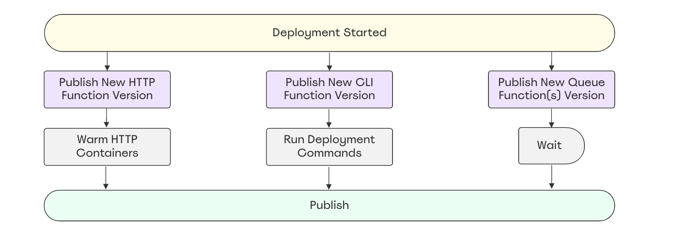

# The Deployment Process

Running `hover build` builds a Docker image, compiles asset files and creates several runtime files in the `.hover/out` directory. With all this ready, Hover is now ready to release a new version of your application.

## Publishing Assets

The deployment process starts by uploading asset files to a new directory inside the S3 assets bucket. Inside the runtime files, Hover will populate the `ASSET_URL` environment variable to point to the absolute URL of that directory:

```
https://<distribution_id>.cloudfront.net/<build_id>
```

## Pushing The Docker Image

During this step, Hover will tag the `<stage>:latest` local image with the build ID and publish it to the ECR repository.

Hover will generate an authorization token to access the ECR repo prior to pushing the image. This will only work when the AWS user/role committing the deployment has the `ecr:GetAuthorizationToken` permission.

## Updating The CouldFormation Stack

Hover generates a CloudFormation template for each deployment and updates the CloudFormation stack for the stage with the new template.

If you haven't done any changes to the stage manifest file, the only update CloudFormation will perform is updating the `ImageUri` attribute of all the Lambda functions created for the stage.

However, if you have done changes to the manifest file, the generated template will reflect these changes and CloudFormation will perform them.


## Publishing New Lambda Versions

For each function Hover creates, a `live` alias is created. All services integrating with those functions (ApiGateway, SQS, EventBridge, ...) invoke the alias instead of the function itself. This alias points to the latest published version of the Lambda.

After the very first deployment, Lambda creates a `$LATEST` version tag for every function and the `live` alias points to it by default. For each deployment after that, a new version of the function is published and Hover updates the alias to point to this new version.

So after the `ImageUri` attribute is updated by the CloudFormation stack. Hover publishes a new version of each Lambda.

## Warming The New HTTP Function Version

In order to reduce the possibility of cold starts after each deployment. Hover warms a number of HTTP function containers with the new docker image. These containers will be ready to handle requests the moment the `live` alias starts pointing to the new version.

During the warming, the container is booted up and a dummy request is sent to PHP-FPM to warm the OPCache.

## Running Deployment Commands

If you have any deployment commands defined in your stage manifest file, Hover runs these command on the new CLI function version and displays the results. If any of the commands fail, the deployment process will be cancelled and the `live` alias of all the functions will not be updated to the new function version.

## Activating The New Release

Now that everything works, Hover will update the `live` alias of all functions to point to the latest version. That's when APIGateway, SQS and EventBridge start communicating with the newly deployed release of your application.


